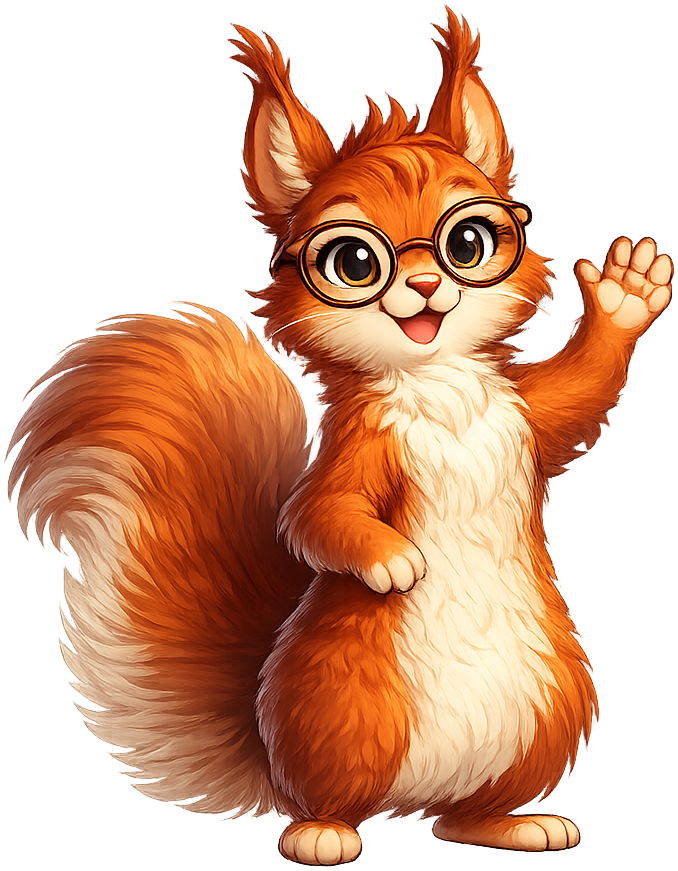
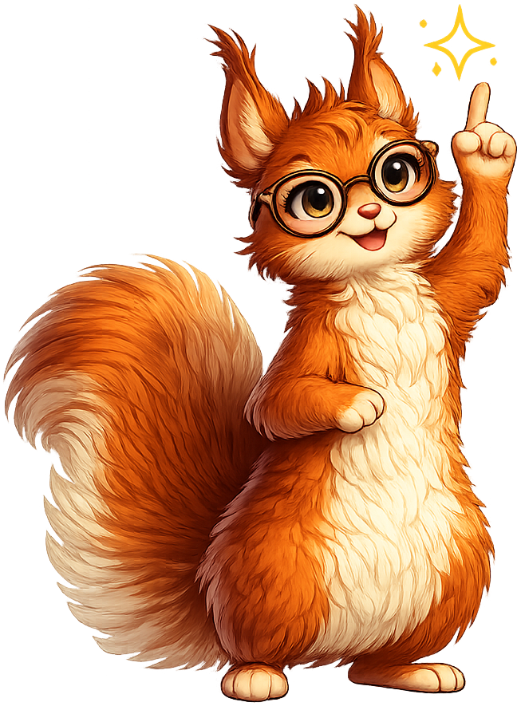
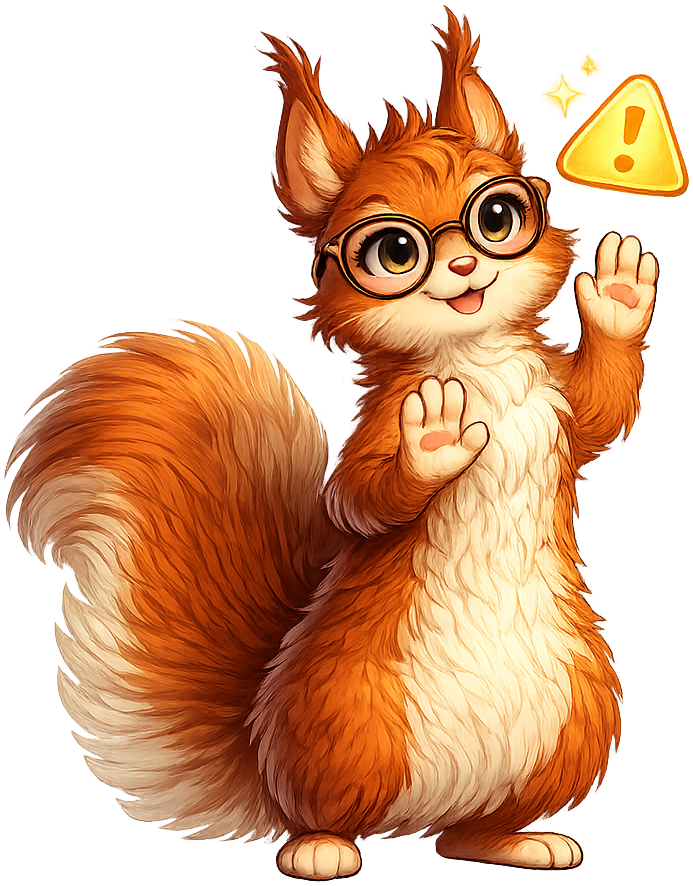
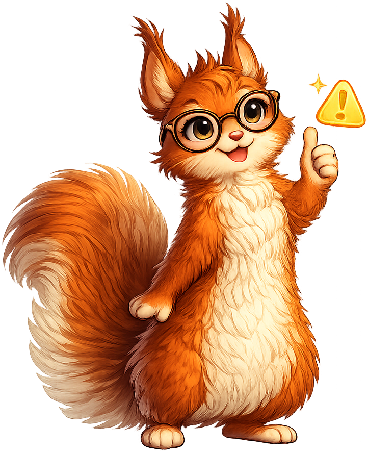

# Sylvia the Statistical Squirrel — Mascot Style Guide

Meet **Sylvia the Statistical Squirrel** (Syl, to friends), your guide through this AP Statistics textbook! Sylvia is a reformed acorn hoarder turned data enthusiast who helps you see how statistics is a superpower for understanding the world.

**Catchphrases:** "Let's crack this nut!" and "Time to squirrel away this knowledge!"

---

## All Mascot Admonition Styles

!!! mascot-neutral "A Note from Sylvia"
    
    This is the **neutral** style, used for general sidebars or introductions
    where no specific emotional tone is needed.

!!! mascot-welcome "Welcome, Future Statisticians!"
    
    Let's crack this nut together — by the end of this chapter, you'll have
    a brand-new statistical superpower! This is the **welcome** style, used
    at the start of each chapter.

!!! mascot-thinking "Key Insight"
    
    Notice that the standard deviation isn't just a number — it tells us
    how spread out our data really is. *That's* a data point worth
    collecting! This is the **thinking** style, used for key concepts.

!!! mascot-tip "Sylvia's Tip"
    
    Pro tip: when in doubt, draw it out! Sketching a quick histogram or
    boxplot makes patterns jump off the page. This is the **tip** style,
    used for helpful hints and study strategies.

!!! mascot-warning "Watch Out!"
    
    Heads up — correlation is *not* causation! Two variables can move
    together without one causing the other. This is the **warning** style,
    used for common mistakes and misconceptions.

!!! mascot-celebration "Great Progress!"
    
    Look at you go! You just mastered something that took mathematicians
    centuries to figure out. Time to squirrel away this knowledge! This
    is the **celebration** style, used for achievements and section
    completions.

!!! mascot-encourage "You've Got This!"
    
    Hypothesis testing trips up *a lot* of folks at first — even me, and
    I do this for fun. Take a breath, work one step at a time, and it'll
    click. This is the **encouraging** style, used for difficult content.
