# List of MicroSims for AP Statistics

Interactive Micro Simulations to help students learn statistics fundamentals through hands-on exploration.

-   **[Addition Rule Visualizer](./addition-rule-visualizer/index.md)**

    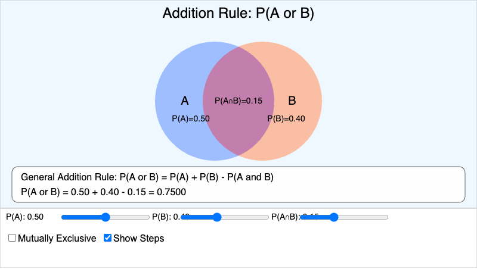

    Interactive Venn diagram for visualizing and calculating P(A or B) using the addition rule, with support for mutually exclusive events.

-   **[Association Detector Visualization](./association-detector/index.md)**

    

    Interactive MicroSim for comparing conditional distributions using side-by-side 100% stacked bar charts to identify evidence of association between categorical variables.

-   **[Association Strength Spectrum](./association-strength-spectrum/index.md)**

    

    An interactive MicroSim that helps students classify associations between categorical variables as strong, moderate, weak, or none by visualizing two-way tables and segmented bar charts.

-   **[Bar Graph Builder](./bar-graph-builder/index.md)**

    

    An interactive MicroSim where students construct bar graphs from categorical data by entering category names and frequencies, with options for vertical/horizontal orientation.

-   **[Bias vs. Variability Target](./bias-variability-target/index.md)**

    

    Interactive target diagram illustrating the difference between bias (systematic error) and variability (random error) in sampling with four scenarios.

-   **[Binomial Probability Explorer](./binomial-probability-explorer/index.md)**

    Interactive exploration of the binomial distribution showing how n and p affect shape, center, and spread, with step-by-step formula calculation.

-   **[Boxplot Builder](./boxplot-builder/index.md)**

    

    An interactive MicroSim for constructing and interpreting boxplots by connecting numerical summary statistics to their visual representation with step-by-step animation.

-   **[Boxplot Comparison](./boxplot-comparison/index.md)**

    

    Side-by-side boxplot comparison tool for analyzing distributions across 2-4 groups with pre-loaded datasets and summary statistics.

-   **[Central Limit Theorem Demonstration](./clt-demonstration/index.md)**

    Interactive visualization demonstrating the Central Limit Theorem by showing how sampling distributions of means become approximately normal regardless of population shape, with multiple population types and sample sizes.

-   **[Chapter 2 Concept Map](./chapter-2-concept-map/index.md)**

    

    An interactive concept map showing the hierarchy of key concepts in Chapter 2, including Organizing Data, Single Variable Displays, Two Variable Analysis, and Association.

-   **[Combining Random Variables Visualizer](./combining-random-variables/index.md)**

    Interactive visualization showing how means and variances combine when adding or subtracting independent random variables, demonstrating that variances always add.

-   **[Correlation Calculator](./correlation-calculator/index.md)**

    

    Step-by-step correlation coefficient calculator showing intermediate values, z-scores, and the complete calculation process with real-time scatterplot updates.

-   **[Correlation Pitfalls Demo](./correlation-pitfalls/index.md)**

    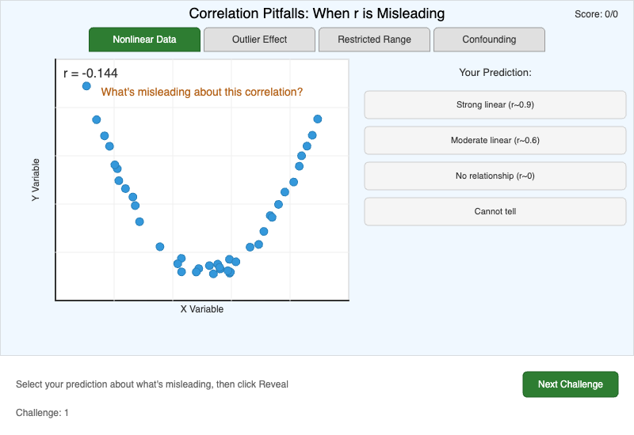

    Interactive demonstration of common correlation mistakes including nonlinear data, outlier effects, restricted range, and confounding variables.

-   **[Correlation Properties Explorer](./correlation-properties/index.md)**

    

    Explore correlation properties by dragging points, toggling outliers, swapping axes, and changing units to see how the correlation coefficient responds.

-   **[Density Curve Area Explorer](./density-curve-area/index.md)**

    

    Interactive visualization showing that area under a density curve represents probability, with draggable boundary lines and multiple curve types.

-   **[Discrete vs Continuous Number Line](./discrete-continuous-numberline/index.md)**

    

    An interactive MicroSim that helps students distinguish between discrete and continuous variables by visualizing how values can be plotted on a number line.

-   **[Distribution Shape Gallery](./distribution-shape-gallery/index.md)**

    

    An interactive infographic showing three types of distribution shapes - unimodal, bimodal, and uniform - with real-world examples, hover tooltips, and a quiz mode.

-   **[Empirical Rule (68-95-99.7)](./empirical-rule/index.md)**

    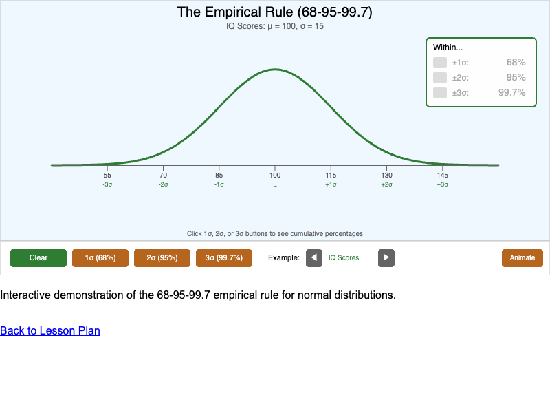

    Interactive demonstration of the 68-95-99.7 rule for normal distributions with animated regions and real-world examples.

-   **[Expected Value Calculator](./expected-value-calculator/index.md)**

    Interactive calculator for computing the expected value of discrete random variables with step-by-step calculation display and real-time validation.

-   **[Frequency Table Explorer](./frequency-table-explorer/index.md)**

    

    An interactive MicroSim where students practice calculating relative frequencies and percentages from raw frequency data using adjustable sliders.

-   **[Geometric Distribution Simulator](./geometric-distribution-sim/index.md)**

    Interactive simulation that runs trials until first success, building up the geometric distribution empirically and comparing to theoretical probabilities.

-   **[Guess the Correlation](./guess-correlation/index.md)**

    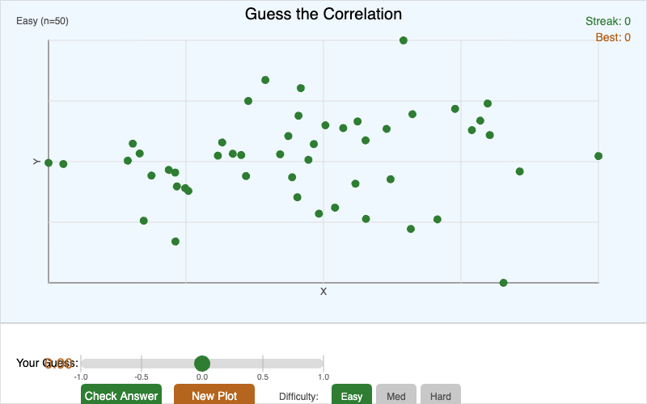

    Correlation estimation game where students guess r-values from scatterplots, building intuition for what different correlation strengths look like.

-   **[Interactive Histogram Explorer](./histogram-explorer/index.md)**

    

    An interactive MicroSim where students examine how changing bin width affects histogram appearance, with multiple datasets and display options.

-   **[Household Income Boxplot Explorer](./household-income-boxplot/index.md)**

    

    Interactive MicroSim that uses a boxplot to summarize household incomes and highlight right-skew.

-   **[Hypothesis Testing Decision Flowchart](./hypothesis-testing-flowchart/index.md)**

    

    Step-by-step interactive flowchart guiding students through the complete hypothesis testing procedure from stating hypotheses to making conclusions.

-   **[Inference Workflow](./inference-workflow/index.md)**

    Interactive infographic showing how sampling distributions connect samples to populations in the statistical inference process, with paths for both confidence intervals and hypothesis tests.

-   **[Influential Points Explorer](./influential-points-explorer/index.md)**

    

    Investigate how high-leverage and outlier points affect regression lines by dragging a test point and comparing results with and without it.

-   **[Interactive Dotplot Builder](./interactive-dotplot-builder/index.md)**

    

    An interactive MicroSim where students click on a number line to add data points and construct a dotplot, demonstrating how dotplots visualize quantitative data.

-   **[Law of Large Numbers Demonstrator](./law-large-numbers/index.md)**

    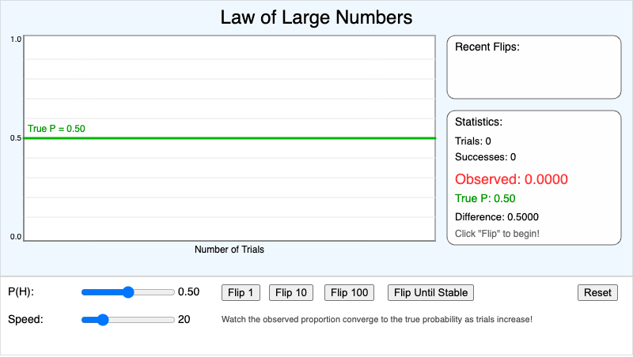

    Interactive visualization demonstrating how empirical probability converges to theoretical probability as the number of trials increases.

-   **[Least Squares Explorer](./least-squares-explorer/index.md)**

    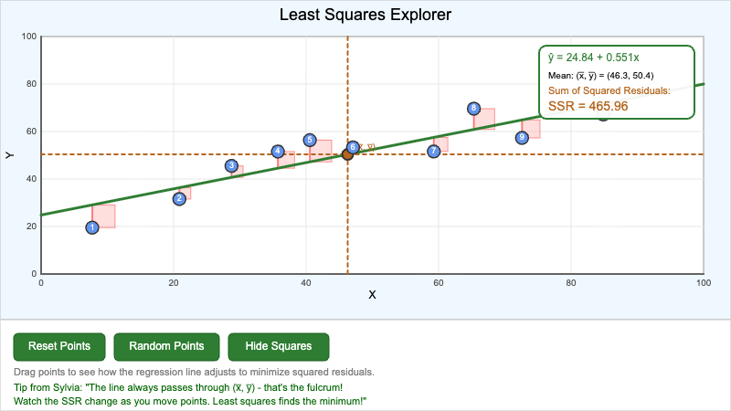

    Interactive visualization showing how the least squares method finds the best-fit regression line by minimizing squared residuals with draggable data points.

-   **[Mean as Balance Point](./mean-balance-point/index.md)**

    

    Interactive visualization showing the mean as the balance point of a distribution, with draggable data points and real-time mean calculation.

-   **[Mean vs Median Skewness](./mean-median-skewness/index.md)**

    

    Interactive visualization showing how mean and median positions differ based on distribution shape, with outlier buttons to demonstrate resistance.

-   **[Normal Distribution Explorer](./normal-distribution-explorer/index.md)**

    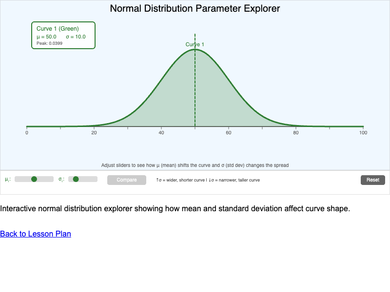

    Interactive visualization showing how mean (μ) and standard deviation (σ) affect the shape and position of a normal distribution curve.

-   **[Normal Probability Calculator](./normal-probability-calc/index.md)**

    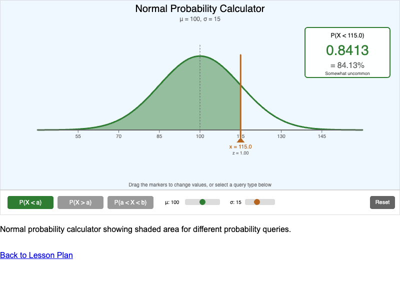

    Interactive calculator for computing probabilities from normal distributions with draggable boundary markers and step-by-step solutions.

-   **[Normal Probability Plot Explorer](./normal-probability-plot/index.md)**

    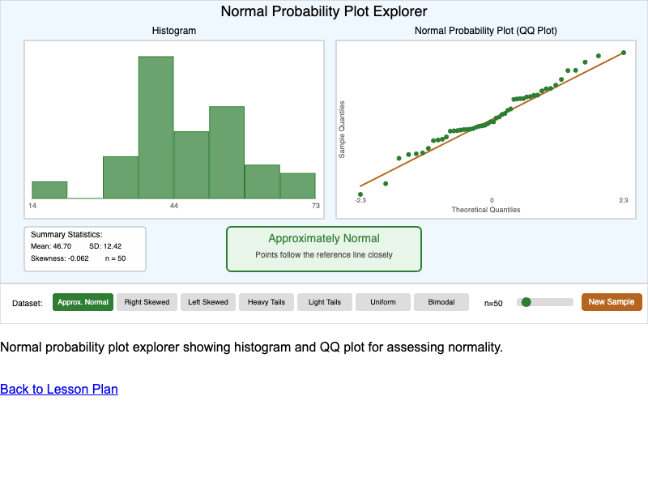

    Interactive visualization for assessing normality using histograms and QQ plots with multiple distribution types and sample sizes.

-   **[Outlier Detection](./outlier-detection/index.md)**

    

    Interactive visualization of the 1.5 × IQR rule for identifying outliers with adjustable multiplier and fence calculations.

-   **[Outlier Detective Game](./outlier-detective/index.md)**

    

    An interactive game where students identify outliers in real-world datasets by examining visual separation in dotplots and histograms.

-   **[P-Value Visualizer](./p-value-visualizer/index.md)**

    

    Interactive visualization of p-values as shaded areas under the standard normal distribution for one-sided and two-sided hypothesis tests.

-   **[Parameter vs Statistic Comparison](./parameter-statistic-compare/index.md)**

    

    An interactive MicroSim demonstrating the difference between population parameters and sample statistics, showing how statistics vary while parameters remain fixed.

-   **[Pattern Recognition Gallery](./pattern-recognition-gallery/index.md)**

    

    Classify scatterplots by their form: linear positive, linear negative, nonlinear, or no association. Features a gallery of thumbnails with instant feedback.

-   **[Pie Chart vs Bar Graph Comparison](./pie-vs-bar-comparison/index.md)**

    

    An interactive MicroSim that displays the same data as both a pie chart and bar graph, helping students analyze when each visualization type is most effective.

-   **[Population and Sample Visualization](./population-sample-visual/index.md)**

    

    An interactive MicroSim that demonstrates the relationship between a population and a sample by letting students select individuals from a population.

-   **[Probability Distribution Bar Chart](./probability-distribution-bar/index.md)**

    Interactive bar chart showing the probability distribution for rolling a fair six-sided die, demonstrating that each outcome has equal probability of 1/6.

-   **[Probability Simulation Lab](./probability-simulation-lab/index.md)**

    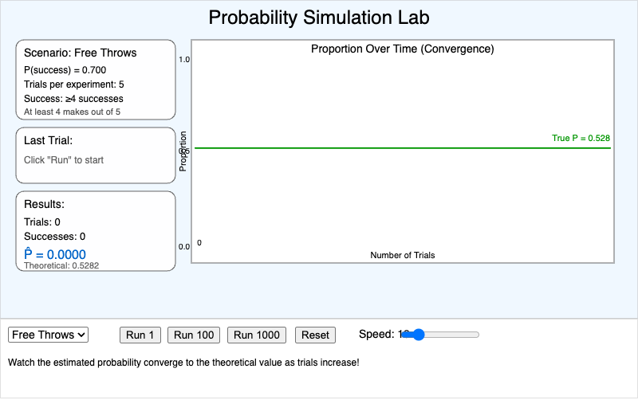

    Interactive simulation for estimating probabilities through repeated trials, demonstrating how empirical probability converges to theoretical probability.

-   **[Quartile Visualization](./quartile-visualization/index.md)**

    

    Interactive visualization showing how quartiles divide data into four equal parts with color-coded regions and adjustable sample size.

-   **[Question Wording Effects](./question-wording-effects/index.md)**

    

    Interactive simulation demonstrating how question wording dramatically affects survey responses through neutral, positive, and negative framings.

-   **[Random Digit Table Simulator](./random-digit-table/index.md)**

    

    Interactive simulation for practicing simple random sampling using a random digit table with step-by-step selection process.

-   **[Random Variable Concept Map](./random-variable-concept-map/index.md)**

    Interactive concept map showing relationships between all random variable concepts including probability distributions, expected value, variance, and binomial/geometric distributions.

-   **[Regression Analysis Tool](./regression-analysis-tool/index.md)**

    

    Complete regression analysis dashboard with scatterplot, residual plot, statistics panel, and prediction calculator for comprehensive data analysis.

-   **[Residual Calculator](./residual-calculator/index.md)**

    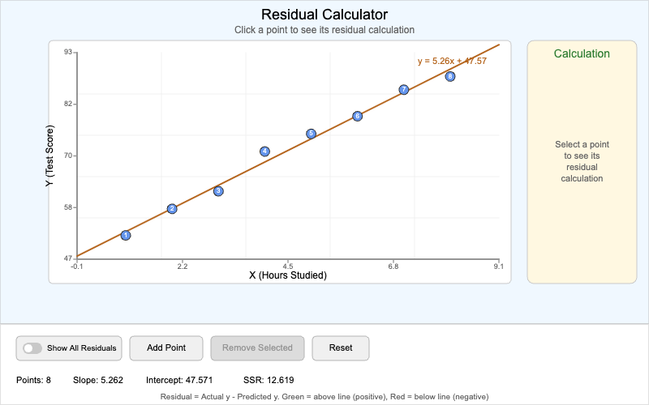

    Interactive visualization for computing and understanding regression residuals, showing the vertical distance between actual data points and predicted values.

-   **[Residual Plot Analyzer](./residual-plot-analyzer/index.md)**

    

    Side-by-side scatterplot and residual plot display for evaluating whether a linear model is appropriate by analyzing residual patterns.

-   **[Skewness Explorer](./skewness-explorer/index.md)**

    

    Interactive MicroSim where students classify distributions as symmetric, skewed left, or skewed right by examining histograms with real-world contexts.

-   **[Slope Intercept Explorer](./slope-intercept-explorer/index.md)**

    

    Manipulate slope and y-intercept sliders to see how changes affect the regression line and predictions, with comparison to the best-fit line.

-   **[SOCS Description Builder](./socs-description-builder/index.md)**

    

    An interactive MicroSim where students compose complete distribution descriptions using the SOCS framework (Shape, Outliers, Center, Spread).

-   **[Sample Space Explorer](./sample-space-explorer/index.md)**

    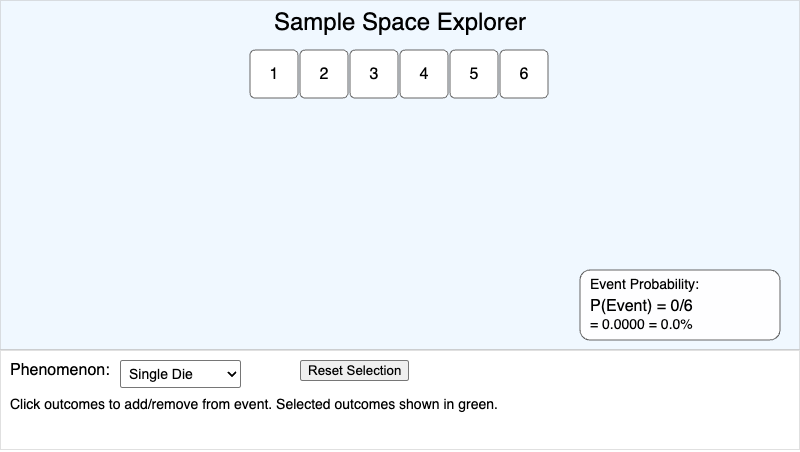

    Interactive visualization for exploring sample spaces of common probability experiments including dice rolls, coin flips, and card draws.

-   **[Sampling Distribution Calculator](./sampling-distribution-calculator/index.md)**

    Interactive calculator for finding probabilities involving sample means or proportions, with step-by-step solutions showing standard error, z-score, and probability calculations.

-   **[Sampling Distribution Concept](./sampling-distribution-concept/index.md)**

    Interactive visualization showing how taking many samples and calculating a statistic from each creates a predictable sampling distribution, with dynamic histogram building.

-   **[Scatterplot Builder](./scatterplot-builder/index.md)**

    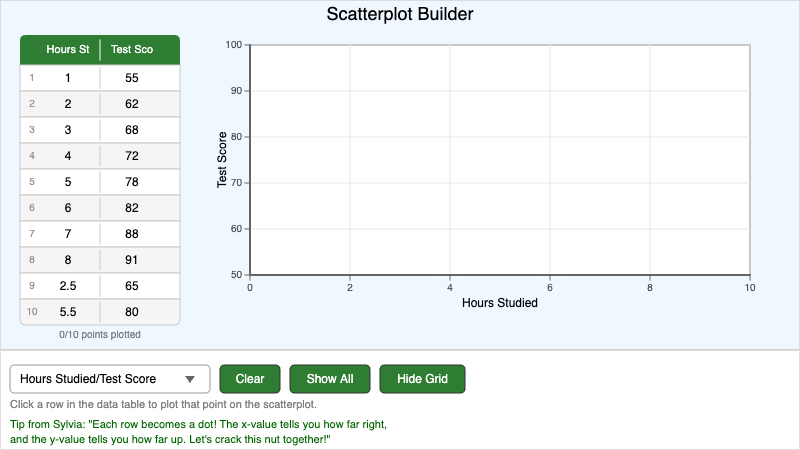

    Build scatterplots interactively by clicking data rows to plot points. Features multiple datasets and customizable axis labels.

-   **[Standard Deviation Calculator](./std-dev-calculator/index.md)**

    

    Step-by-step variance and standard deviation calculator showing the complete calculation process with visual representation.

-   **[Standard Error Explorer](./standard-error-explorer/index.md)**

    Interactive visualization showing how sample size affects the standard error of sampling distributions for both proportions and means, with real-time formula calculations.

-   **[Stemplot Constructor](./stemplot-constructor/index.md)**

    

    An interactive MicroSim where students interpret how data values decompose into stems and leaves to build a stemplot visualization.

-   **[Stratified vs. Cluster Sampling](./stratified-cluster-compare/index.md)**

    

    Interactive visualization comparing stratified and cluster sampling methods, showing how each selects individuals from groups differently.

-   **[Study Design Concept Map](./study-design-map/index.md)**

    

    Interactive concept map showing how foundational statistics concepts connect in the context of a real research study about sleep and academic performance.

-   **[Survey Design Checklist](./survey-design-checklist/index.md)**

    

    Interactive tool for evaluating survey quality by identifying sampling and question design problems in real-world scenarios.

-   **[Symmetric Distribution Identifier](./symmetric-distribution/index.md)**

    

    An interactive quiz MicroSim where students learn to recognize symmetric and asymmetric distributions by comparing histogram shapes.

-   **[Test Scores Boxplot Explorer](./test-scores-boxplot/index.md)**

    

    Interactive MicroSim that uses boxplots to summarize exam scores and compare two class sections.

-   **[Test Statistic Calculator](./test-statistic-calculator/index.md)**

    

    Interactive calculator for computing z-test statistics in one-proportion hypothesis tests with step-by-step calculations and conditions checking.

-   **[Two-Proportion Z-Test Calculator](./two-proportion-test/index.md)**

    

    Complete two-sample z-test calculator for comparing proportions between independent groups with visual comparison and conclusion generator.

-   **[Two-Way Table Calculator](./two-way-table-calculator/index.md)**

    

    An interactive calculator for computing marginal and conditional distributions from a two-way (contingency) table with editable cells.

-   **[Type I and Type II Error Visualizer](./type-error-visualizer/index.md)**

    

    Interactive simulation demonstrating Type I (false positive) and Type II (false negative) errors with cumulative error rate tracking.

-   **[Undercoverage Visualization](./undercoverage-viz/index.md)**

    

    Interactive visualization showing how incomplete sampling frames lead to biased estimates with adjustable undercoverage and group differences.

-   **[Variable Types Concept Map](./variable-types-concept-map/index.md)**

    

    An interactive concept map showing the hierarchy of variable types in statistics, including categorical and quantitative variables.

-   **[Venn Diagram Problem Solver](./venn-diagram-solver/index.md)**

    

    Interactive tool for solving probability problems using Venn diagrams, calculating counts and probabilities for overlapping events.

-   **[Z-Score Calculator](./z-score-calculator/index.md)**

    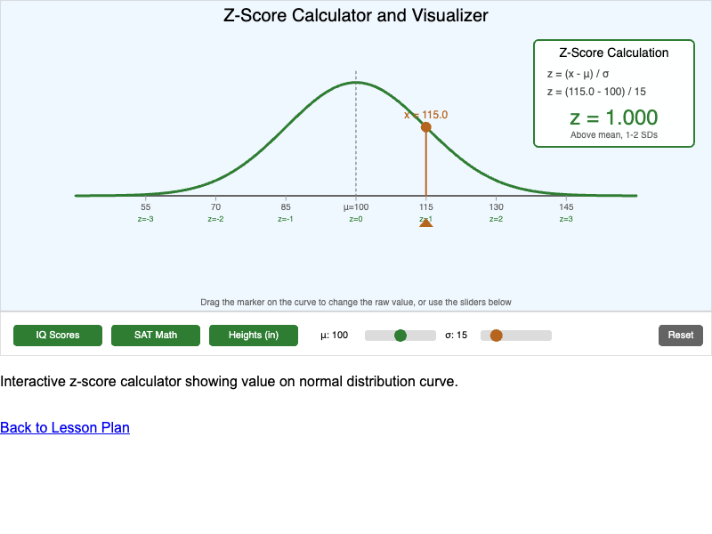

    Interactive z-score calculator and visualizer showing value position on a normal distribution curve with real-world presets.

