# List of MicroSims for AP Statistics

Interactive Micro Simulations to help students learn statistics fundamentals through hands-on exploration.

-   **[Association Detector Visualization](./association-detector/index.md)**

    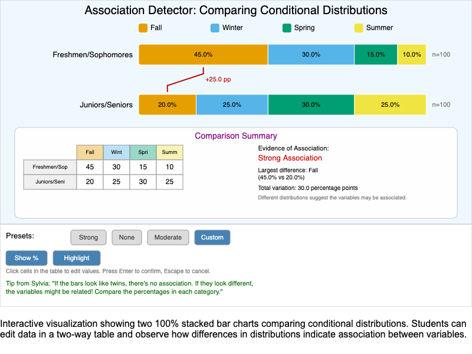

    Interactive MicroSim for comparing conditional distributions using side-by-side 100% stacked bar charts to identify evidence of association between categorical variables.

-   **[Association Strength Spectrum](./association-strength-spectrum/index.md)**

    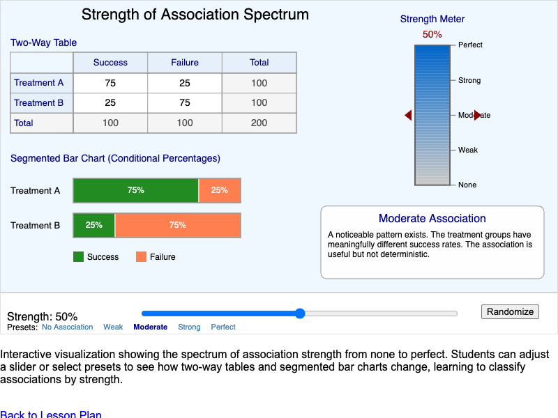

    An interactive MicroSim that helps students classify associations between categorical variables as strong, moderate, weak, or none by visualizing two-way tables and segmented bar charts.

-   **[Bar Graph Builder](./bar-graph-builder/index.md)**

    

    An interactive MicroSim where students construct bar graphs from categorical data by entering category names and frequencies, with options for vertical/horizontal orientation.

-   **[Chapter 2 Concept Map](./chapter-2-concept-map/index.md)**

    

    An interactive concept map showing the hierarchy of key concepts in Chapter 2, including Organizing Data, Single Variable Displays, Two Variable Analysis, and Association.

-   **[Discrete vs Continuous Number Line](./discrete-continuous-numberline/index.md)**

    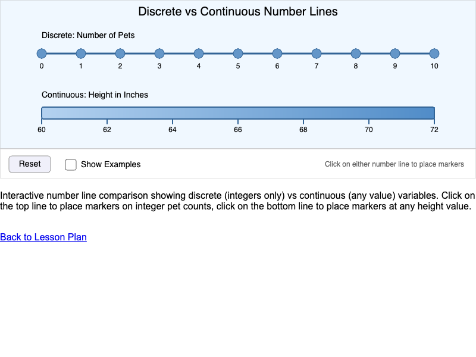

    An interactive MicroSim that helps students distinguish between discrete and continuous variables by visualizing how values can be plotted on a number line.

-   **[Distribution Shape Gallery](./distribution-shape-gallery/index.md)**

    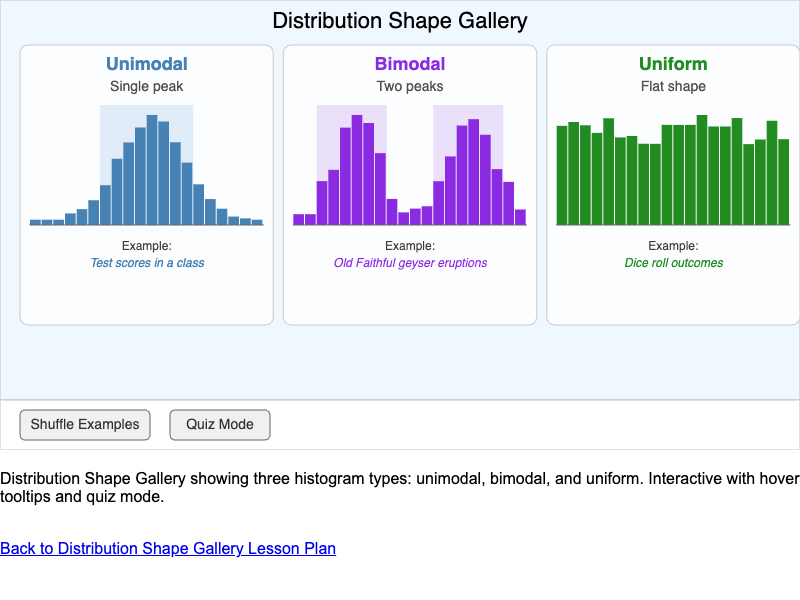

    An interactive infographic showing three types of distribution shapes - unimodal, bimodal, and uniform - with real-world examples, hover tooltips, and a quiz mode.

-   **[Frequency Table Explorer](./frequency-table-explorer/index.md)**

    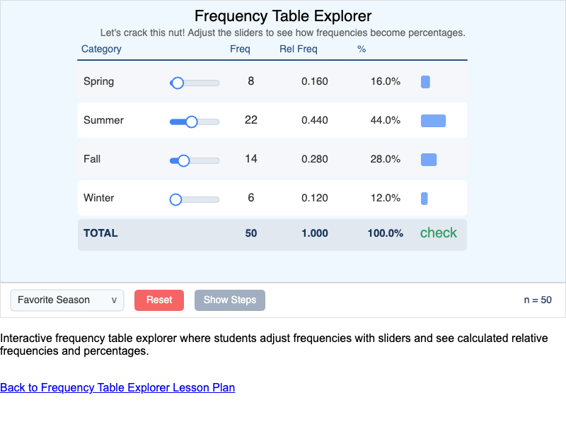

    An interactive MicroSim where students practice calculating relative frequencies and percentages from raw frequency data using adjustable sliders.

-   **[Interactive Dotplot Builder](./interactive-dotplot-builder/index.md)**

    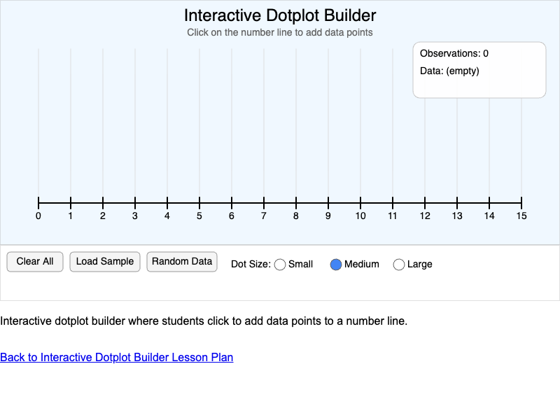

    An interactive MicroSim where students click on a number line to add data points and construct a dotplot, demonstrating how dotplots visualize quantitative data.

-   **[Interactive Histogram Explorer](./histogram-explorer/index.md)**

    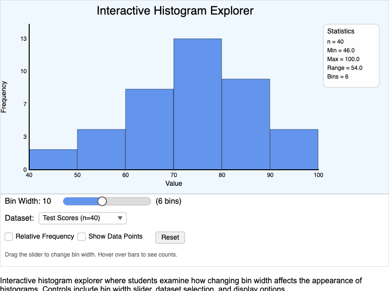

    An interactive MicroSim where students examine how changing bin width affects histogram appearance, with multiple datasets and display options.

-   **[Outlier Detective Game](./outlier-detective/index.md)**

    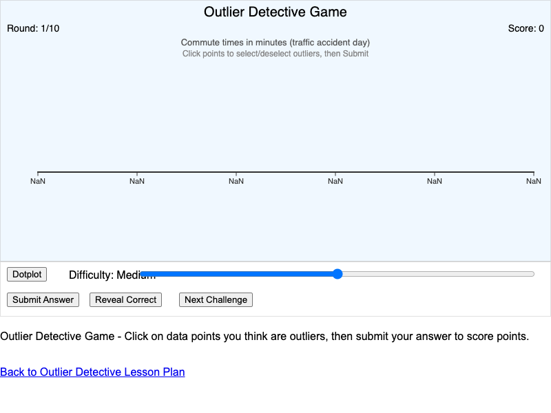

    An interactive game where students identify outliers in real-world datasets by examining visual separation in dotplots and histograms.

-   **[Parameter vs Statistic Comparison](./parameter-statistic-compare/index.md)**

    

    An interactive MicroSim demonstrating the difference between population parameters and sample statistics, showing how statistics vary while parameters remain fixed.

-   **[Pie Chart vs Bar Graph Comparison](./pie-vs-bar-comparison/index.md)**

    

    An interactive MicroSim that displays the same data as both a pie chart and bar graph, helping students analyze when each visualization type is most effective.

-   **[Population and Sample Visualization](./population-sample-visual/index.md)**

    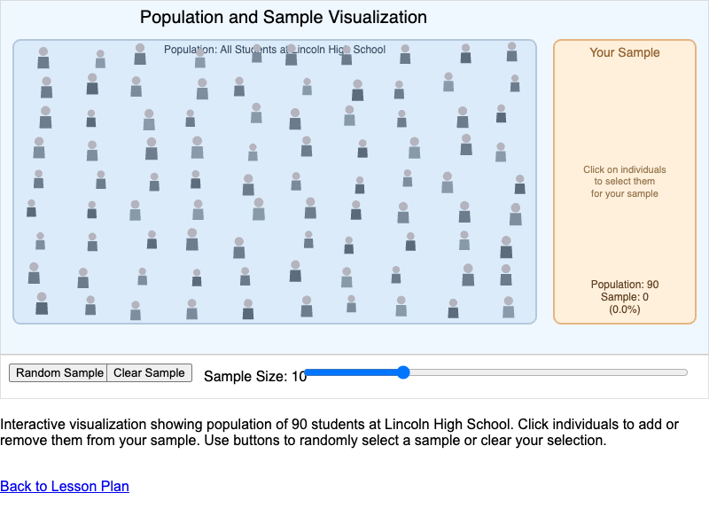

    An interactive MicroSim that demonstrates the relationship between a population and a sample by letting students select individuals from a population.

-   **[Skewness Explorer](./skewness-explorer/index.md)**

    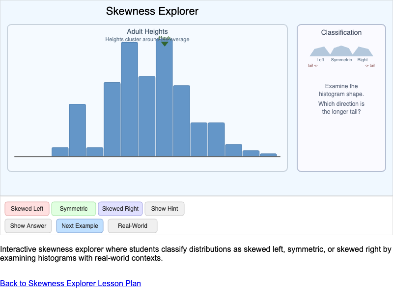

    Interactive MicroSim where students classify distributions as symmetric, skewed left, or skewed right by examining histograms with real-world contexts.

-   **[SOCS Description Builder](./socs-description-builder/index.md)**

    

    An interactive MicroSim where students compose complete distribution descriptions using the SOCS framework (Shape, Outliers, Center, Spread).

-   **[Stemplot Constructor](./stemplot-constructor/index.md)**

    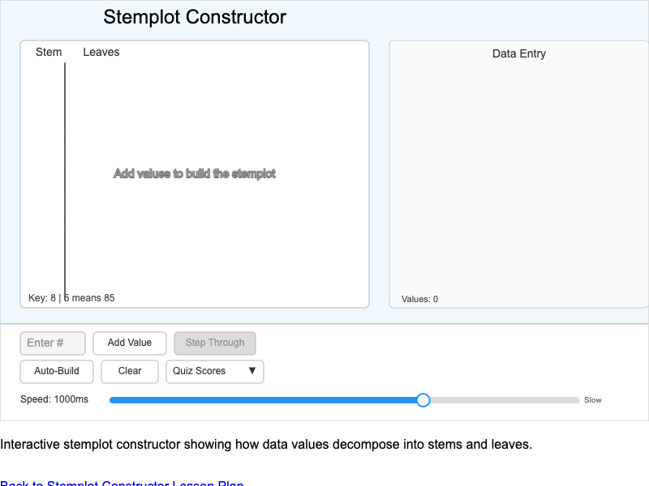

    An interactive MicroSim where students interpret how data values decompose into stems and leaves to build a stemplot visualization.

-   **[Study Design Concept Map](./study-design-map/index.md)**

    

    Interactive concept map showing how foundational statistics concepts connect in the context of a real research study about sleep and academic performance.

-   **[Symmetric Distribution Identifier](./symmetric-distribution/index.md)**

    

    An interactive quiz MicroSim where students learn to recognize symmetric and asymmetric distributions by comparing histogram shapes.

-   **[Two-Way Table Calculator](./two-way-table-calculator/index.md)**

    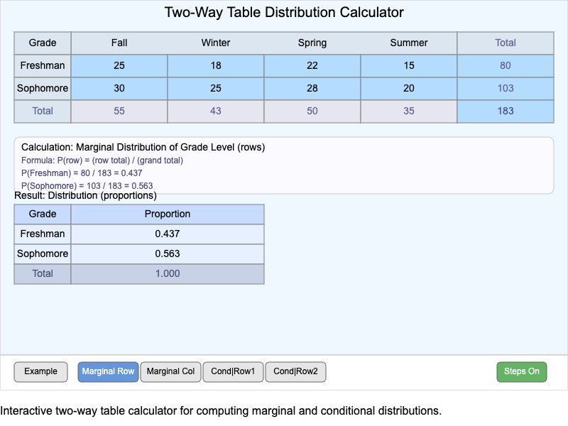

    An interactive calculator for computing marginal and conditional distributions from a two-way (contingency) table with editable cells.

-   **[Variable Types Concept Map](./variable-types-concept-map/index.md)**

    

    An interactive concept map showing the hierarchy of variable types in statistics, including categorical and quantitative variables.

